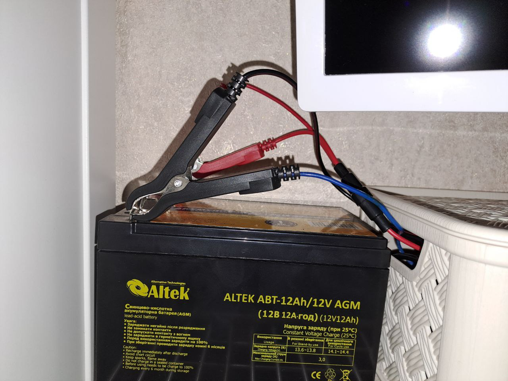

# Безінверторний ДБЖ

ДБЖ без інвертора є більш економічним, оскільки не відбувається подвійне перетворення напруги.

# Характеристики

1. Сумарна потужність 100 Вт
2. Акумулятор захищений запобіжником
3. Виходи на USB та Type-C
4. Можна заряджати навіть ноутбук
5. Можна переключати режим роботи порта Type-C і одного з USB портів. 3 режими 
   * Відключено 
   * З резервуванням - буде використовувати акумулятор при відсутності напруги
   * Без резервування - працює, тільки коли є напруга в мережі, акумулятор не використовує
6. Вольтметр на передній панелі
7. Зарядник схований в коробці
8. Можна відключити акумулятор

# Компоненти

1. [Імпульсний блок живлення 12В, 8.3А](https://led-one.com.ua/eshop/bloki-pitaniia_1/blok-pitaniia-100w_1/?utm_source=google&utm_campaign=PM_bloki_pitaniya_Ukraina&utm_medium=cpc&utm_term=&gclid=Cj0KCQiAic6eBhCoARIsANlox84pwzk3CR8yw1WUiYLN0xxXlRhhhpKd6uEgUGHWKnq5H9XKJl-a_zkaAp8cEALw_wcB)
2. [Акумулятор AGM, 12В, 12Ah](https://f.ua/alva-battery/akkumuljator-aw12-12.html?noseoredirect)
3. [Зарядний пристрій 6,12В, 4А](https://rozetka.com.ua/ua/rztk_sbt_400/p330752674/)
4. [Реле двополюсне з обмоткою 220В, з колодкою](https://www.aliexpress.com/item/32844411297.html?spm=a2g0o.productlist.main.3.28b82a13QRGRCm&algo_pvid=64704651-5956-455c-aca3-303c209878f5&algo_exp_id=64704651-5956-455c-aca3-303c209878f5-1&pdp_ext_f=%7B%22sku_id%22%3A%2265137086030%22%7D&pdp_npi=2%40dis%21USD%212.19%211.8%21%21%21%21%21%402145280e16748080511078172d0708%2165137086030%21sea&curPageLogUid=saBuVEE9arL5)
5. [Запобіжник 10А](https://m-teh.com.ua/zapobizhnik-5x20-f10a/)
6. [Тримач запобіжника](https://m-teh.com.ua/utrimuvach-zapobizhnika-z-kabelem-5kh20mm-18awg/)
7. [Вольтметр з USB портами](https://www.joom.com/en/products/5d9c5b5d28fc710101eb69d4?variant_id=5d9c5b5d28fc710401eb69d6)
8. [Модулі type-c і USB з підтримкою QC3.0](https://www.aliexpress.com/item/1005001607840645.html?spm=a2g0o.order_list.order_list_main.41.6d7e1802tXZOuk)
9. [Понижуючий перетворювач напруги](https://www.aliexpress.com/item/32717477565.html?spm=a2g0o.productlist.main.77.32b92caeHo4xcH&algo_pvid=96402339-d07e-4511-9a83-f809b6ec1334&algo_exp_id=96402339-d07e-4511-9a83-f809b6ec1334-38&pdp_ext_f=%7B%22sku_id%22%3A%2266642912074%22%7D&pdp_npi=2%40dis%21USD%211.41%211.16%21%21%21%21%21%402145274c16748086562532007d06ca%2166642912074%21sea&curPageLogUid=iKegY2h0EaSL)

